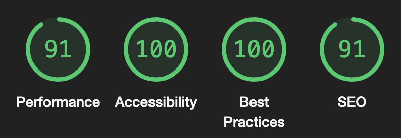

# DogCeo React App

Welcome to **DogCeo React App**! This is a React application built using the [dog.ceo](https://dog.ceo/dog-api/) API that allows users to select dog breeds and sub-breeds and display images of them.

## Table of Contents

- [How made this](#how-made-this)
- [Used Technologies](#used-technologies)
- [Installation](#installation)
- [Use](#use)
- [Project structure](#project-structure)

## How made this

    For this project I use react js, css, tailwindcss, typescript, axios, and jest for testing.

    First we use vite to create the project and install dependencies. 
    Then we proceed to parse the dog.ceo api, which contains breeds and sub-breeds.
    At this point we can see the following call types:

    https://dog.ceo/api/breed/hound/list
    https://dog.ceo/api/breed/hound/afghan/images

    Both required to be able to show images for breed and sub breed.
    First we created a view, in which all the logic was in App.tsx, we decided to use react-select for the multiple select, and then we made use of some SOLID principles, such as Single Responsibility and Dependency Inversion.
    When applying these concepts, all the logic falls files for hooks, components and api.
    After having in correct operation, the api, the components and the main view with the react-select component, we proceed to the test creation.
    The tests are created with Jest and @testing-library/react, this with the objective of being able to make test easier with react and at least it is the only library that I have used.

### Learning

  In this challenge I can learn more about SOLID principles, and how it works on the frontend, now I know in my previous jobs I have used this, but now I can talk about how to use this from experience.

  #### Why Tailwind
  I like to work with helpers, and if this doesn't exist, I make my own helpers, but for this challenge, Tailwind helpers are just necessity.

  Now, I usually use Tailwind because it allows me to create more customized and maintainable design systems, for me it's like having a basic base of helpers created in css.

## Used Technologies

- **React**: Library for building user interfaces.
- **TypeScript**: Superset of JavaScript that adds static typing.
- **Vite**: Fast frontend development tool.
- **Axios**: Promise-based HTTP client.
- **Tailwind CSS**: CSS framework for efficient design.
- **SCSS**: CSS preprocessor.
- **Jest**: Testing framework for JavaScript.
- **Testing Library**: Utilities for testing React components.
- **ESLint**: Static code analysis tool to identify problematic patterns in JavaScript code.
- **Prettier**: Code formatter.

## Installation

### Prerequisites

- Node.js >= 16.0.0
- npm >= 7.0.0

### Installation Steps

1. Clone the repository:

   ```
   git clone https://github.com/tu-usuario/dogceo-react-app.git
   cd dogceo-react-app
   ```

2. Install the dependencies:

   ```
   npm install
   # o
   yarn install
   ```

3. Start the development server:

   ```
   npm run dev
   # o
   yarn dev
   ```

4. The application will be available at <http://localhost:5173/>.

### Use

      1. Select one or more breeds from the first dropdown.
      2. If the selected breed has sub-breeds, a second dropdown will appear to select the sub-breeds.
      3. Click on the "Search" button to fetch and display images of the selected breeds/sub-breeds.
      4. The images will be displayed in a gallery.

### Project structure

```
.
├── jest.config.ts
├── jest.setup.js
├── package-lock.json
├── package.json
├── postcss.config.js
├── tailwind.config.js
├── tsconfig.app.json
├── tsconfig.json
├── tsconfig.node.json
├── vite.config.ts
└── src
    ├── App.tsx
    ├── main.tsx
    ├── vite-env.d.ts
    ├── styles
    │   └── global.css
    ├── components
    │   ├── SelectBreeds
    │   │   ├── SelectBreeds.tsx
    │   │   ├── SelectBreeds.test.tsx
    │   └── ImageGallery
    │       ├── ImageGallery.tsx
    │       ├── ImageGallery.test.tsx
    ├── hooks
    │   └── useBreeds.ts
    └── services
        └── api
            ├── api.ts
            ├── breedsService.ts
            ├── breedsService.test.ts
```

#### Description of Files and Directories

- jest.config.ts: Jest configuration for unit tests.
- jest.setup.js: Initial configuration file for Jest.
- package.json: Project configuration and dependency management file.
- tailwind.config.js: Tailwind CSS configuration.
- tsconfig.json: General TypeScript configuration.
- Directory Structure of src
- src/App.tsx: Main component of the application.
- src/main.tsx: Entry point of the application.
- src/styles/global.css: Global styles of the application.

##### Components

- src/components/SelectBreeds/SelectBreeds.tsx: Component for selecting dog breeds.
- src/components/SelectBreeds/SelectBreeds.test.tsx: Unit tests for the SelectBreeds component.
- src/components/ImageGallery/ImageGallery.tsx: Component for displaying the image gallery.
- src/components/ImageGallery/ImageGallery.test.tsx: Unit tests for the ImageGallery component.

##### Hooks

- src/hooks/useBreeds.ts: Custom hook for handling dog breeds logic.

##### API Services

- src/services/api/api.ts: General API configuration.
- src/services/api/breedsService.ts: Services for interacting with the dog breeds API.
- src/services/api/breedsService.test.ts: Unit tests for the API services.
- This modular and well-organized structure facilitates project scalability and maintenance.

#### Lighthouse




